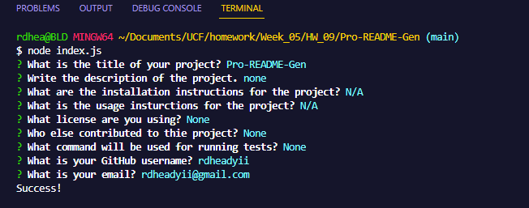

# Pro-README-Gen
  

  ## Description
  This project is for generating a Professional README. It is done by running node index.js in the terminal and one will be prompted with questions to answer that will then write those answers to a README.md file. 

  This project is great for sharpening JavaScript skills and getting used to using Node.js

  ## Table of Contents
  * [Installation](#installation)
  * [Usage](#usage)
  * [License](#license)
  * [Display](#display)
  * [Contributors](#contributors)
  * [Tests](#tests)
  * [Questions](#questions)

  ## Installation
  N/A

  ## Usage
  N/A

  ## License
  
  ## Display
  

  ## Contributors
  None

  ## Tests
  None

  ## Questions
  rdheadyii@gmail.com

  https://github.com/rdheadyii
